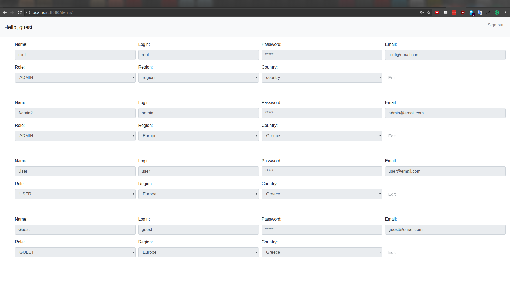

# Interface implementation

## Sign-in page

## Sign-in page validation

## User's list - guest account

## User's list - user account

## User's list - admin account

## Edit user validation

## Add user

## Add user validation

