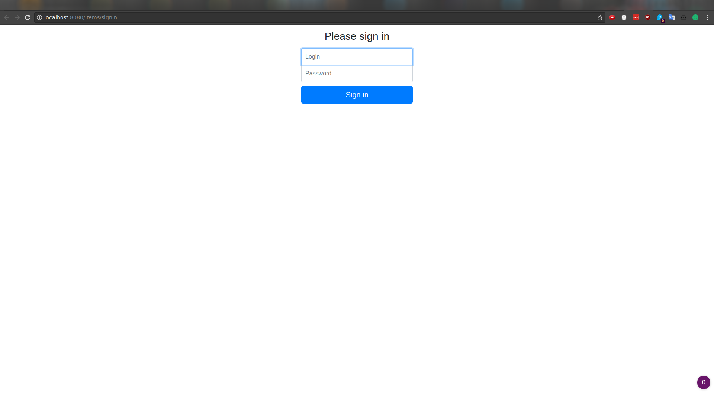
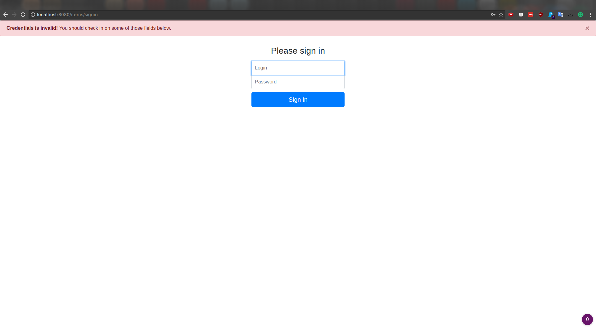
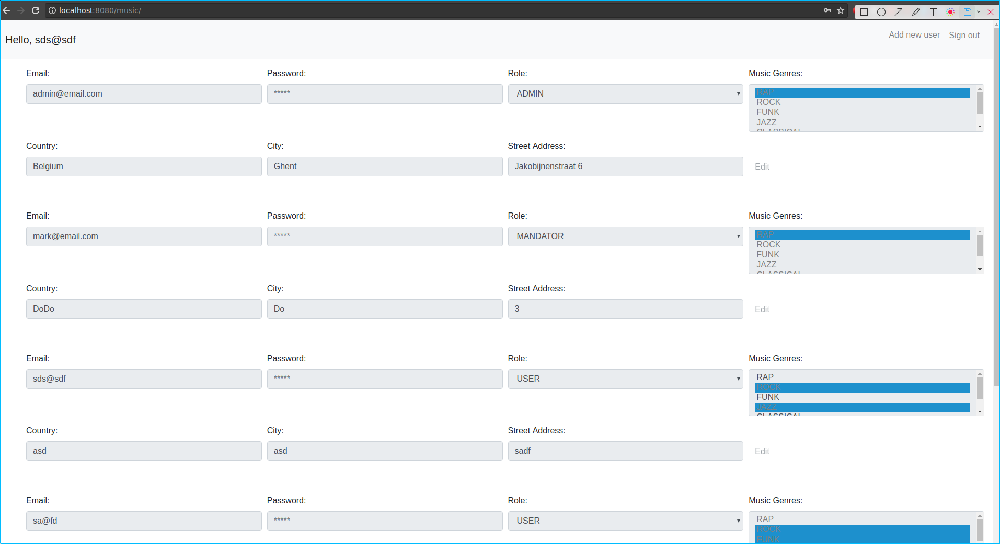
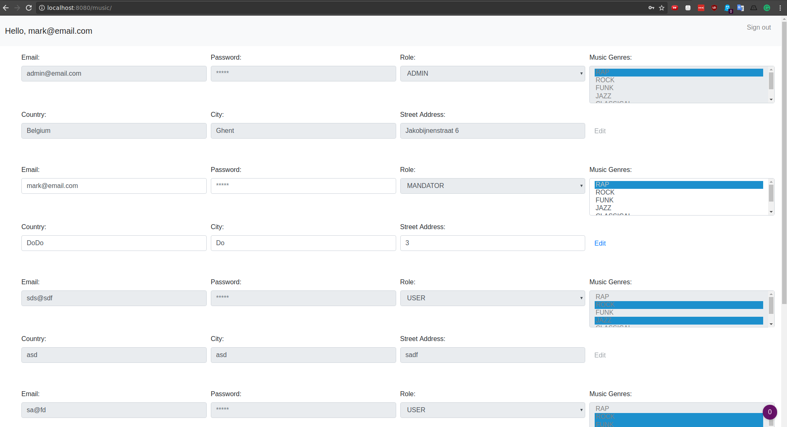
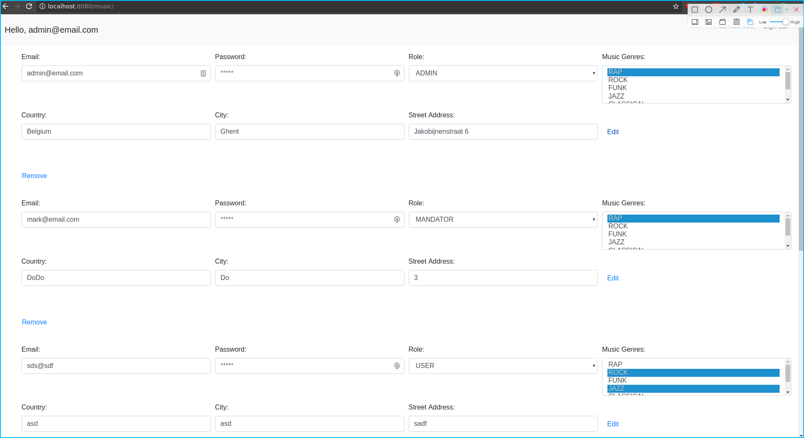
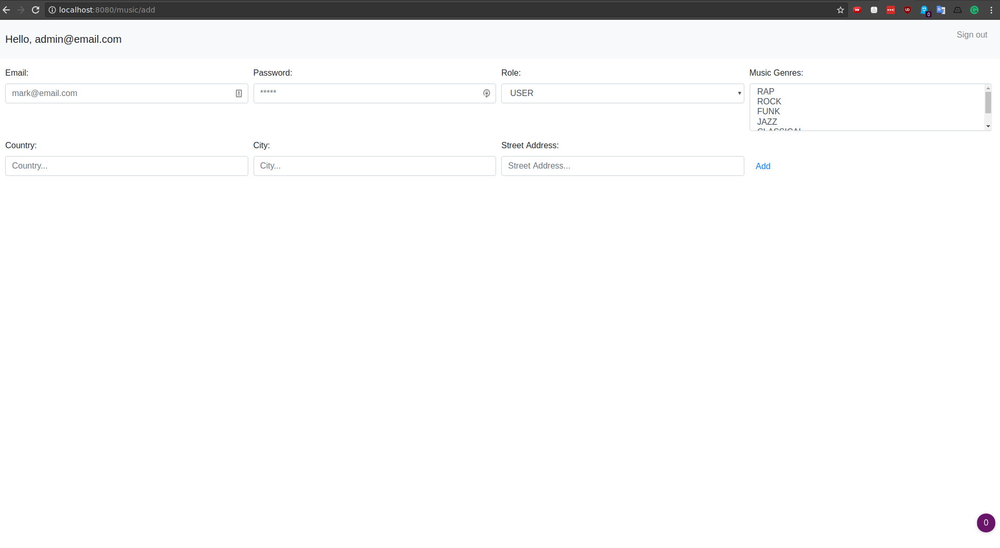
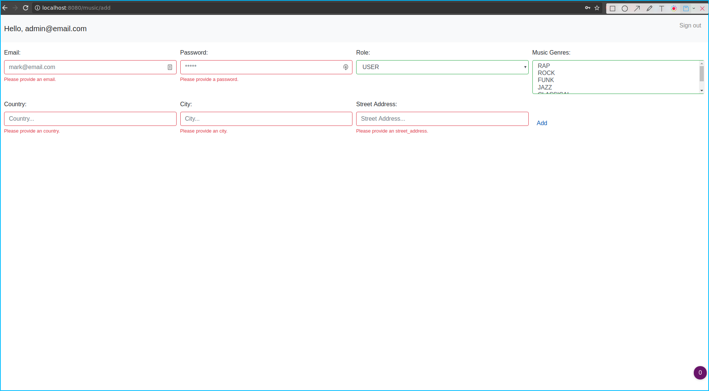

# Implementation of UI

## Sign-in page

## Sign-in page validation

z
## User's list - user account

## User's list - mandator account

## User's list - admin account

## Add user

## Add user validation

