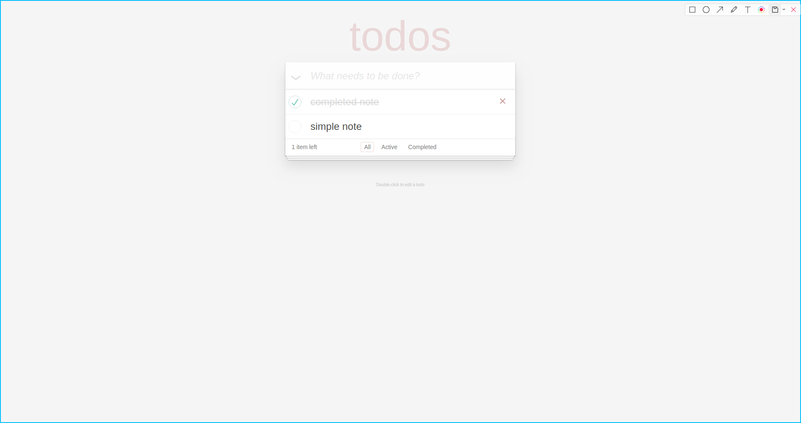

# Hibernate

Hibernate ORM is an object-relational mapping tool for the Java programming language. It provides a framework for mapping an object-oriented domain model to a relational database.

## Implementation of UI

### All tasks

### Filter not completed tasks

z
### Filter completed tasks

### One completed task

